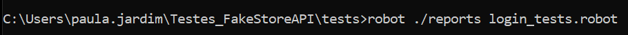
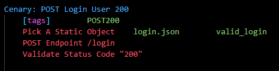
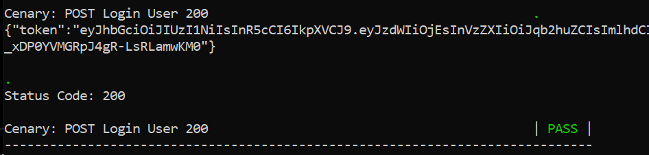

# Fake Store API - Test Cases

* This repository is composed by test cases developed with **Robot Framework** for the **Fake Store API**.
* This project tests were written with  **VS Code**.
* The **Git** tool was used to turn the project into a repository and push it to GitHub later on.

##  Project's Features

This project contains a set of tests for [Fake Store API](https://fakestoreapi.com/) endpoints.
 

The files on this project are organized as described bellow:

| Folder | Description |
| :---: | :---: |
| [keywords](./keywords/) | Files where I developed Keywords for the test cases of each endpoint. |
| [media](./media/) | Folder with the image files you see in this document. |
| [others](./others/) | Contains a detailed list of all test cases throughout the project. |
| [support](./support/) | Contains the file *base.robot* used to set the libraries and files imported to the project. |
| [common](./support/common/) | Folder with a keyword file that has keywords used for test cases in more than one endpoint. |
| [fixtures](./support/fixtures/) | Stores json files with static data for the tests. |
| [variables](./support/variables/) | Contains a file to set the variables used along the project. |
| [tests](./tests/) | Here is where we find all test cases in the project. Each endpoint has it's own file. |

Besides the files listed above, we can find the license and the document you're reading right now in the global scope of the project.

##  How to create a copy of this project

Top obtain a copy of this project in your own machine, follow the steps bellow:

1. *Fork* this project in you GitHub profile.
2. Download a IDE that's compatible with Python* [here]() are some options.
3. Download a [Git](https://git-scm.com/downloads) version that's compatible with your operation system.
4. After you set up Git in your local machine, run the following code:

<code>
$ git clone https://github.com/BeatrizJardimm/Tests_FakeStoreAPI.git

</code>

Now you have a copy of the project in your local machine! :)

*In this project i used **VS CODE**, because, aside from being compatible with python, it recognizes Robot Framework and has a very intuitive interface.

### Setting VSCode 

As already said, i used VSCode to develop this project, and some extensions in this IDE were essential to the enhance and organize the code. If you're using VSCode like i did, I recommend you use these extentions to smooth the development of this project and others. The extentions are listed below:

* Robot Framework Intellisense
* Python (Intellisense oficial)
* Hyper Term Theme
* Material Icon Theme
* Rainbow Brackets
* Tabnine AI autocomplete

##  How ot run the project

First, you need to [download Python](https://www.python.org/downloads/) in your machine (I'm using version 3.8.2).
 
After that, intall [Node.js](https://nodejs.org/en/download/) LTS version.
 
To make sure both were correctly intalled, you just have to open your cmd and type the comands: <code>python -v</code> and <code>node -v</code>, this way you can verify the version in which they were downloaded.
 
 
Now, if you're using Windows, to download Robot Framework you can use Python's pip install command.
So, opn you cmd again and type <code>pip install robotframework</code>.
 
If your OS isn't Windows, you'll find how to install Robot Framework through this [link](https://robotframework.org/robotframework/latest/RobotFrameworkUserGuide.html#installation-instructions).
 
Run <code>robot --version</code> to check if the framework was sucessfully installed and it's version.
 
 
In this project, I used a few libraries from Robot Framework, and to install these libraries you can type the following commands in your console:
 
<code>pip install robotframework-browser</code>
 
<code>pip install robotframework-requests</code>
 
<code>pip install robotframework-faker</code>
 

Bear in mind that these libraries are essential and if they're not correctly downloaded, the project won't run.

Now you can clean this cmd (or open another one) to run the test cases. To do that, you have to acess the right folder to where the test case files are, and that is: Tests_FakeStoreAPI/tests/
 
Make sure that the path is correct and after that, to run the files you have to type the following command:
 
<code>robot -d ./reports file_name.robot</code>
 
As an example, we have an image of the console with the command to run the /login test cases below:

    

If you want to run only one specific test case, you can type in <code>robot -d ./reports -i TAG file_name.robot</code>, where "tag" has to be replaced with the tag for the test case of interest. The test case tags can be found both in the [Test Cases file](./others/TestCases.txt) and at the first line of each test case, as shown in the example below:

    

In this case, the command you have to type in your console is:
 
<code>robot -d ./reports -i POST200 login_tests.robot</code>

After running the tests, what you'll be returned looks like: 

    

Where the first and last lines show the name of the test case, the show message is the one returned by the API and the status code returned is also sent by the API. If these elements match the ones expected by the test case, we get the PASS message in green, as seen in the image, but if not, we get the message FAIL in red.
 

Now you can run tests in any endpoint for any kind of request you want!

##  Notes while developing:

    While i was developing the Test Cases for this API, i encountered an awful lot of errors.
    At pretty much every test case i developed to, theoericaly, find a 400 error, i was returned a 200 status code, and that should not happen for different reasons for each test. Below in the Reports section, you will find a table with every test case, the answer i got from the test and the answer i should've gotten. You'll also find green and red squares beside these test cases, the green squares are for the test i got the expected response/status code and the red squares are for the test cases with requests that did not return what was expected of them. And yes, there are a LOT more red squares than green squares.

##  Reports

In this section, i created a table with every test case for each endpoint. The features of the tables are written in the section above.

* /login (9 tests)

|   Label   |   Test Objective  |   Expected Result  |  Obtained Result |
|   :---:   |       :---:       |        :---:       |       :---:      |
|  | POST - Login user | Status Code: 200   Access Token | Status Code: 200   Access Token |
|  | POST - Login without username | Not Documented | Gets into a loop and after a wilhe returns a 524 runtime error |
|  | POST - Login without password | Not Documented | Gets into a loop and after a wilhe returns a 524 runtime error |
|  | POST - Login with an invalid username | Not Documented | Status Code: 401   body = "username or password is incorrect" |
|  | POST - Login with the wrong password | Not Documented | Status Code: 401   body = "username or password is incorrect" |
|  | GET - Get list of logins | Not documented, but i expected a 404 error | Status Code: 404   body = HTML body |
|  | PUT - Edit logins | Not documented, but i expected a 404 error | Status Code: 404   body = HTML body |
|  | PATCH -Edit logins | Not documented, but i expected a 404 error | Status Code: 404   body = HTML body |
|  | DELETE - Delete a login | Not documented, but i expected a 404 error | Status Code: 404   body = HTML body |

* /users (40 tests)

|   Label   |   Test Objective  |   Expected Result  |  Obtained Result |
|   :---:   |       :---:       |        :---:       |       :---:      |
|  | GET - List all users | Status Code: 200   List of all users' data | Status Code: 200   List of all users' data |
|  | GET - Get user by ID | Status Code: 200   User's data | Status Code: 200   User's data |
|  | GET - Get invalid user | Not documented, but i expected a 404 error | Status Code: 200   body = 'null' |
|  | GET - Get limited quantity of users | Status Code: 200   List of users with given IDs | Status Code: 200   List of users with given IDs |
|  | GET - Get out-of-range quantity of users | Not documented, but i expected a 404 error | Status Code: 200   List of all users |
|  | GET - Get a list of all users on sorted order | Status Code: 200   Sorted list of all users | Status Code: 200   Sorted list of all users |
|  | GET - Get a list of all users passing an invalid sorted order | Not documented, but i expected a 404 error | Status Code: 200   List of all users |
|  | POST - Add new user | Status Code: 201   New user's data | Status Code: 200   New user's ID |
|  | POST - Add new user with unavaliable email | Status Code: 400   A message explaining that the email is already being used | Status Code: 200   New user's ID |
|  | POST - Add new user with existent username | Status Code: 400   A message explaining that the username is already being used | Status Code: 200   Existent user's ID |
|  | POST - Add new user with empty email | Status Code: 400   A message explaining that the email space is empty | Status Code: 200   New user's ID |
|  | POST - Add new user with empty username | Status Code: 400   A message explaining that the username space is empty | Status Code: 200   New user's ID |
|  | POST - Add new user with empty password | Status Code: 400   A message explaining that the password space is empty | Status Code: 200   New user's ID |
|  | POST - Add new user with empty 'name' parameter | Status Code: 400   A message explaining that the 'name' space is empty | Status Code: 200   New user's ID |
|  | POST - Add new user with empty 'address' parameter | Status Code: 400   A message explaining that the 'address' space is empty | Status Code: 200   New user's ID |
|  | POST - Add new user with empty phone | Status Code: 400   A message explaining that the phone space is empty | Status Code: 200   New user's ID |
|  | PUT - Update user | Status Code: 200   User's updated data | Status Code: 200   User's updated data |
|  | PUT - Add new user | Status Code: 201   New user's data | Status Code: 200   New user's data |
|  | PUT - Update a user with the wrong endpoint | Status Code: 404 | Status Code: 404   body = HTML body |
|  | PUT - Update a user with unavaliable email | Status Code: 400   A message explaining that the email is already being used | Status Code: 200   User's updated data |
|  | PUT - Update a user with existent username | Status Code: 400   A message explaining that the username is already being used | Status Code: 200   User's updated data |
|  | PUT - Update a user with empty email | Status Code: 400   A message explaining that the email space is empty | Status Code: 200   User's updated data |
|  | PUT - Update a user with empty username | Status Code: 400   A message explaining that the username space is empty | Status Code: 200   New user's ID |
|  | PUT - Update a user with empty password | Status Code: 400   A message explaining that the password space is empty | Status Code: 200   User's updated data |
|  | PUT - Update a user with empty 'name' parameter | Status Code: 400   A message explaining that the 'name' space is empty | Status Code: 200   User's updated data |
|  | PUT - Update a user with empty 'address' parameter | Status Code: 400   A message explaining that the 'address' space is empty | Status Code: 200   User's updated data |
|  | PUT - Update a user with empty phone | Status Code: 400   A message explaining that the phone space is empty | Status Code: 200   User's updated data |
|  | PATCH - Update user | Status Code: 200   User's updated data | Status Code: 200   User's updated data |
|  | PATCH - Add new user | Status Code: 201   New user's data | Status Code: 200   New user's data |
|  | PATCH - Update a user with the wrong endpoint | Status Code: 404 | Status Code: 404   body = HTML body |
|  | PATCH - Update a user with unavaliable email | Status Code: 400   A message explaining that the email is already being used | Status Code: 200   User's updated data |
|  | PATCH - Update a user with existent username | Status Code: 400   A message explaining that the username is already being used | Status Code: 200   User's updated data |
|  | PATCH - Update a user with empty email | Status Code: 400   A message explaining that the email space is empty | Status Code: 200   User's updated data |
|  | PATCH - Update a user with empty username | Status Code: 400   A message explaining that the username space is empty | Status Code: 200   New user's ID |
|  | PATCH - Update a user with empty password | Status Code: 400   A message explaining that the password space is empty | Status Code: 200   User's updated data |
|  | PATCH - Update a user with empty 'name' parameter | Status Code: 400   A message explaining that the 'name' space is empty | Status Code: 200   User's updated data |
|  | PATCH - Update a user with empty 'address' parameter | Status Code: 400   A message explaining that the 'address' space is empty | Status Code: 200   User's updated data |
|  | PATCH - Update a user with empty phone | Status Code: 400   A message explaining that the phone space is empty | Status Code: 200   User's updated data |
|  | DELETE - Delete a user | Status Code: 204 | Status Code: 200 |
|  | DELETE - Delete an invalid user | Status Code: 404 | Status Code: 200   body = 'null' |

* /products (40 tests)

|   Label   |   Test Objective  |   Expected Result  |  Obtained Result |
|   :---:   |       :---:       |        :---:       |       :---:      |
|  | GET - List all products | Status Code: 200   List with all the products | Status Code: 200   List with all the products |
|  | GET - Get product by ID | Status Code: 200   Product's data | Status Code: 200   Product's data |
|  | GET - Get an invalid product | Status Code: 400   A message explaining that a product with that ID couldn't be found | Status Code: 200 |
|  | GET - Get limited quantity of products | Status Code: 200   List of products with given IDs | Status Code: 200   List of products with given IDs |
|  | GET - Get out-of-range quantity of products | Status Code: 404 | Status Code: 200   List of all products |
|  | GET - Get a list of all products on sorted order | Status Code: 200   Sorted list of all products | Status Code: 200   Sorted list of all products |
|  | GET - Get a list of all products passing an invalid sorted order | Status Code: 404 | Status Code: 200   List of all products |
|  | GET - Get products' categories | Status Code: 200   List of all categories | Status Code: 200   List of all categories |
|  | GET - Get products of a specific category | Status Code: 200   List of products of a category | Status Code: 200   List of products of a category |
|  | GET - Get products of an invalid category | Status Code: 404 | Status Code: 200   Empty list of products |
|  | POST - Add new product | Stauts Code: 201   New product's data | Status Code: 200   New product's data |
|  | POST - Add product with a name that already exists | Stauts Code: 400   Message explaining that the title is already being used | Status Code: 200   New product's data |
|  | POST - Add empty product | Stauts Code: 400   Message explaining that the product is empty | Status Code: 200   New product's data |
|  | POST - Add product with empty title | Stauts Code: 400   Message explaining that the title is empty | Status Code: 200   New product's data |
|  | POST - Add product with empty price | Stauts Code: 400   Message explaining that the price is empty | Status Code: 200   New product's data |
|  | POST - Add product with empty description | Stauts Code: 400   Message explaining that the description is empty | Status Code: 200   New product's data |
|  | POST - Add product with empty image | Stauts Code: 400   Message explaining that the image is empty | Status Code: 200   New product's data |
|  | POST - Add product with empty category | Stauts Code: 400   Message explaining that the category is empty | Status Code: 200   New product's data |
|  | PUT - Update product | Status Code: 200   Product's updated data | Status Code: 200   Product's updated data |
|  | PUT - Add new product | Stauts Code: 201   New product's data | Status Code: 200   New product's data |
|  | PUT - Update product with a name that already exists | Stauts Code: 400   Message explaining that the title is already being used | Status Code: 200   Product's updated data |
|  | PUT - Update empty product | Stauts Code: 400   Message explaining that the product is empty | Status Code: 200   Product's updated data |
|  | PUT - Update product with empty title | Stauts Code: 400   Message explaining that the title is empty | Status Code: 200   Product's updated data |
|  | PUT - Update product with empty price | Stauts Code: 400   Message explaining that the price is empty | Status Code: 200   Product's updated data |
|  | PUT - Update product with empty description | Stauts Code: 400   Message explaining that the description is empty | Status Code: 200   Product's updated data |
|  | PUT - Update product with empty image | Stauts Code: 400   Message explaining that the image is empty | Status Code: 200   Product's updated data |
|  | PUT - Update product with empty category | Stauts Code: 400   Message explaining that the category is empty | Status Code: 200   Product's updated data |
|  | PATCH - Update product | Status Code: 200   Product's updated data | Status Code: 200   Product's updated data |
|  | PATCH - Add new product | Stauts Code: 201   New product's data | Status Code: 200   New product's data |
|  | PATCH - Update product with a name that already exists | Stauts Code: 400   Message explaining that the title is already being used | Status Code: 200   Product's updated data |
|  | PATCH - Update empty product | Stauts Code: 400   Message explaining that the product is empty | Status Code: 200   Product's updated data |
|  | PATCH - Update product with empty title | Stauts Code: 400   Message explaining that the title is empty | Status Code: 200   Product's updated data |
|  | PATCH - Update product with empty price | Stauts Code: 400   Message explaining that the price is empty | Status Code: 200   Product's updated data |
|  | PATCH - Update product with empty description | Stauts Code: 400   Message explaining that the description is empty | Status Code: 200   Product's updated data |
|  | PATCH - Update product with empty image | Stauts Code: 400   Message explaining that the image is empty | Status Code: 200   Product's updated data |
|  | PATCH - Update product with empty category | Stauts Code: 400   Message explaining that the category is empty | Status Code: 200   Product's updated data |
|  | DELETE - Delete product | Status Code: 204 | Status Code: 200   Excluded product's data |
|  | DELETE - Delete invalid product | Status Code: 404 | Status Code: 200   body = 'null' |

* /carts (47 tests)

|   Label   |   Test Objective  |   Expected Result  |  Obtained Result |
|   :---:   |       :---:       |        :---:       |       :---:      |
|  | GET - List all carts | Status Code: 200   List with all the carts | Status Code: 200   List with all the carts |
|  | GET - Get cart by ID | Status Code: 200   Cart's data | Status Code: 200   Cart's data |
|  | GET - Get an invalid cart | Status Code: 400   A message explaining that a cart with that ID couldn't be found | Status Code: 200   body = 'null' |
|  | GET - Get limited quantity of carts | Status Code: 200   List of carts with given IDs | Status Code: 200   List of carts with given IDs |
|  | GET - Get out-of-range quantity of carts | Status Code: 404 | Status Code: 200   List of all carts |
|  | GET - Get a list of all carts on sorted order | Status Code: 200   Sorted list of all carts | Status Code: 200   Sorted list of all carts |
|  | GET - Get a list of all carts passing an invalid sorted order | Status Code: 400 | Status Code: 200   List of all products |
|  | GET - Get products' categories | Status Code: 200   List of all categories | Status Code: 200   List of all categories |
|  | GET - Get carts created on a date range | Status Code: 200   List of carts | Status Code: 400   HTTPError: Bad Request |
|  | GET - Get carts with just the start date | Status Code: 200   List of carts | Status Code: 400   HTTPError: Bad Request |
|  | GET - Get carts with just the end date | Status Code: 200   List of carts | Status Code: 400   HTTPError: Bad Request |
|  | GET - Get carts created on a future date | Status Code: 404   Message explaining that the date is out of range | Status Code: 400   HTTPError: Bad Request |
|  | GET - Get carts created on a past date | Status Code: 404   Message explaining that the date is out of range | Status Code: 400   HTTPError: Bad Request |
|  | GET - Get carts of a specific user | Status Code: 200   Carts' data | Status Code: 200   Carts' data |
|  | GET - Get carts of a user that doesn't have carts | Status Code: 404   A message explaining that carts for that user couldn't be found | Status Code: 200   Empty list of carts |
|  | GET - Get carts of a user that doesn't exist | Status Code: 404   A message explaining that the user doesn't exist | Status Code: 200   Empty list of carts |
|  | POST - Add new cart | Stauts Code: 201   New cart's data | Status Code: 200   New cart's data |
|  | POST - Add cart for a user that doesn't exist | Stauts Code: 404   Message explaining that the user doesn't exist | Status Code: 200   New cart's data |
|  | POST - Add cart for a user that already has a cart | Stauts Code: 400   Message explaining that the user already has a cart | Status Code: 200   New cart's data |
|  | POST - Add cart with empty user ID | Stauts Code: 400   Message explaining that the user ID is empty | Status Code: 200   New cart's data |
|  | POST - Add cart with invalid date | Stauts Code: 400   Message explaining that the date is invalid | Status Code: 200   New cart's data |
|  | POST - Add cart with empty date | Stauts Code: 400   Message explaining that the date is empty | Status Code: 200   New cart's data |
|  | POST - Add cart with empty product | Stauts Code: 400   Message explaining that the product is empty | Status Code: 200   New cart's ID |
|  | POST - Add cart with an invalid product ID | Stauts Code: 400   Message explaining that the product ID is invalid | Status Code: 200   New cart's data |
|  | POST - Add cart with an invalid quantity of products | Stauts Code: 400   Message explaining that the quantity of products is invalid | Status Code: 200   New cart's data |
|  | POST - Add cart with valid and invalid products at the same time | Stauts Code: 400   Message explaining that at least one product is invalid | Status Code: 200   New cart's data |
|  | PUT - Update cart | Status Code: 200   Cart's updated data | Status Code: 200   Cart's updated data |
|  | PUT - Add new cart | Stauts Code: 201   New cart's data | Status Code: 200   New cart's data |
|  | PUT - Update cart without ID | Status Code: 404 | Status Code: 404   body = HTML doc |
|  | PUT - Update cart with a user that doesn't exist | Stauts Code: 400   Message explaining that the user doesn't exist | Status Code: 200   Cart's updated data |
|  | PUT - Update cart with empty user ID | Stauts Code: 400   Message explaining that the user ID is empty | Status Code: 200   Cart's updated data |
|  | PUT - Update cart with invalid date | Stauts Code: 400   Message explaining that the date is invalid | Status Code: 200   New cart's data |
|  | PUT - Update cart with empty date | Stauts Code: 400   Message explaining that the date is empty | Status Code: 200   New cart's data |
|  | PUT - Update cart with empty product | Stauts Code: 400   Message explaining that the product is empty | Status Code: 200   New cart's ID |
|  | PUT - Update cart with an invalid quantity of products | Stauts Code: 400   Message explaining that the quantity of products is invalid | Status Code: 200   New cart's data |
|  | PUT - Update cart with valid and invalid products at the same time | Stauts Code: 400   Message explaining that at least one product is invalid | Status Code: 200   New cart's data |
|  | PATCH - Update cart | Status Code: 200   Cart's updated data | Status Code: 200   Cart's updated data |
|  | PATCH - Add new cart | Stauts Code: 201   New cart's data | Status Code: 200   New cart's data |
|  | PATCH - Update cart without ID | Status Code: 404 | Status Code: 404   body = HTML doc |
|  | PATCH - Update cart with a user that doesn't exist | Stauts Code: 400   Message explaining that the user doesn't exist | Status Code: 200   Cart's updated data |
|  | PATCH- Update cart with empty user ID | Stauts Code: 400   Message explaining that the user ID is empty | Status Code: 200   Cart's updated data |
|  | PATCH - Update cart with invalid date | Stauts Code: 400   Message explaining that the date is invalid | Status Code: 200   New cart's data |
|  | PATCH - Update cart with empty date | Stauts Code: 400   Message explaining that the date is empty | Status Code: 200   New cart's data |
|  | PATCH - Update cart with empty product | Stauts Code: 400   Message explaining that the product is empty | Status Code: 200   New cart's ID |
|  | PATCH - Update cart with an invalid quantity of products | Stauts Code: 400   Message explaining that the quantity of products is invalid | Status Code: 200   New cart's data |
|  | PATCH - Update cart with valid and invalid products at the same time | Stauts Code: 400   Message explaining that at least one product is invalid | Status Code: 200   New cart's data |
|  | DELETE - Delete cart | Status Code: 204 | Status Code: 200   Excluded cart's data |
|  | DELETE - Delete cart with invalid ID | Status Code: 404 | Status Code: 200   body = 'null' |

## Saying Goodbye

That's all folks!
With the informations explicited in this document you can access, edit and share this project!

    

I'd like to share the credits of this project with my colleagues Amanda Bressam and Emily Lanzarin. Each one of us developed our own project with the same API, so we helped one another throughout the development. Here are their GitHub profiles if you're wondering who are these amazing girls.
Thanks to both of you! :)

* [Amanda's profile](https://github.com/abressam)
* [Emily's profile](https://github.com/eslanzarin)

 
In addition, I also found a few solutions to my questions in the documentations of the libraries used in the project, these documentations are referenced below:

* [BuiltIn Library](https://robotframework.org/robotframework/latest/libraries/BuiltIn.html)
* [Requests Library](https://marketsquare.github.io/robotframework-requests/doc/RequestsLibrary.html)
* [Fake Store GitHub](https://github.com/keikaavousi/fake-store-api)

##  Author

My [GitHub Profile](https://github.com/BeatrizJardimm).
 
My [LinkedIn Profile](https://www.linkedin.com/in/paula-beatriz-jardim-11882521a/).